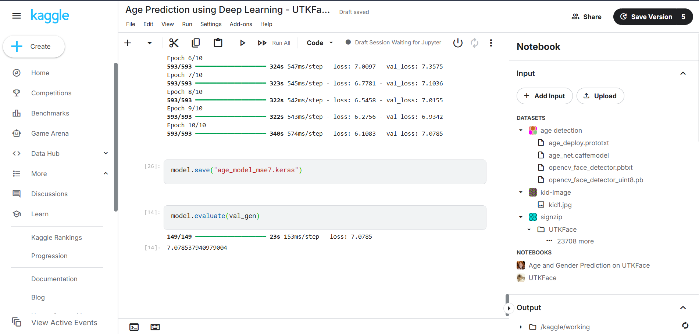
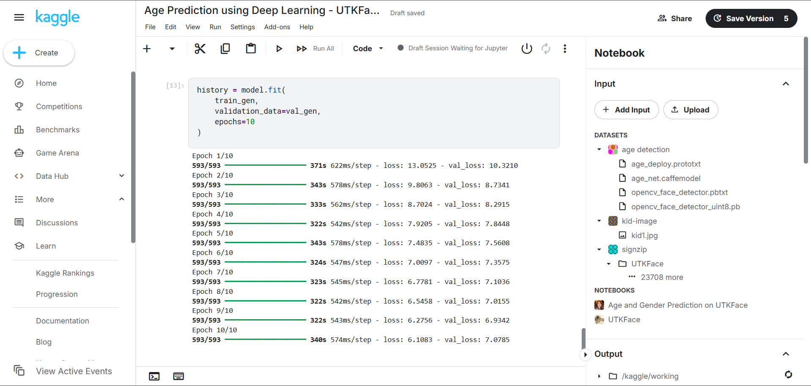

# Age Prediction using Deep Learning (UTKFace Dataset)

## Overview

This project predicts human age from facial images using Deep Learning trained on the UTKFace dataset.

The model estimates age directly from facial images using image preprocessing, training, and evaluation techniques.

---

## Dataset

**UTKFace Dataset**

* Total Images: **23,694**
* Image Format: JPG
* Task: Age Estimation

---

## Features

* Face image preprocessing
* Deep learning based age prediction
* Age estimation from unseen images
* Model evaluation using MAE

---

## Technologies Used

* Python
* TensorFlow / Keras
* OpenCV
* NumPy
* Matplotlib
* Scikit-learn

---

## Model Performance

### Final MAE Result

**Mean Absolute Error (MAE): 7.08 years**

This means the model predicts age with an average error of approximately 7 years.



---

## Training Results

Training process showing learning progression across epochs.



---

## Project Workflow

1. Load UTKFace dataset
2. Extract age labels
3. Preprocess images
4. Train model
5. Evaluate using MAE
6. Predict age

---

## Repository Structure

```text
age-prediction-utkface/
│
├── notebook.ipynb
├── README.md
└── images/
    ├── mae_result.png
    └── training_result.png
```

---

## How to Run

Clone repository:

```bash
git clone <your-repository-url>
```

Install dependencies:

```bash
pip install tensorflow opencv-python numpy matplotlib scikit-learn
```

Open notebook and run all cells.

---

## Future Improvements

* Reduce MAE further using transfer learning
* Real-time webcam age prediction
* Deploy as a web application

---

## Author

Shubh Kumar Mishra

